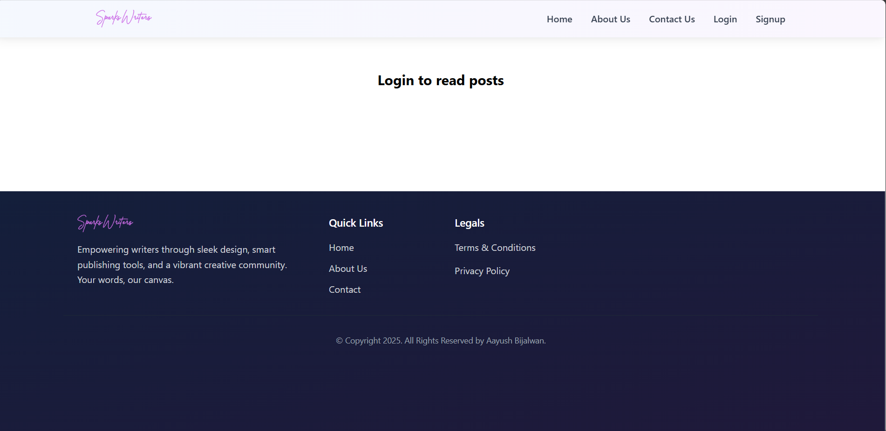

# 📝 Blog Website  
Share your thoughts with the world!  
This modern blog platform lets users read and publish articles — perfect for writers, developers, or anyone who wants to share ideas online.

---

<!-- Live Project Link -->

🚀 **Try it now:** [Visit the Blog]("https://sparks-writers.vercel.app/")

<!-- Project Screenshot -->

<p align="center">
  
</p>

---

## 🛠️ Built With

- **Frontend:** HTML, CSS, React.js
- **Backend As Service:** AppWrite (also provide DataBase and Authentication service)
- **Deployment:** Vercel

## ✨ Features

📰 Dynamic Posts: Easily create and read blog articles  
📋 Post Management: Add, edit, and delete your posts   
🖼️ Clean UI: Simple and modern interface  
📱 Responsive Design: Works seamlessly on mobile, tablet, and desktop  

## 🚀 Getting Started

### Installation

1. **Clone the repository:**
   ```bash
   git clone https://github.com/your-username/blog-website.git
   cd blog-website

2. Install dependencies
   ```bash
    npm install      # or yarn

3. Set up environment variables

   - **VITE_APPWRITE_URL=""**
   - **VITE_APPWRITE_PROJECT_ID=""**
   - **VITE_APPWRITE_DATABASE_ID==""**
   - **VITE_APPWRITE_COLLECTION_ID=""**
   - **VITE_APPWRITE_BUCKET_ID=""**
   - **VITE_TINYMCE_API_KEY=""**

4. Run the development server
   
   npm run dev 

## 📄 License 

This project is licensed under the MIT License. 

---